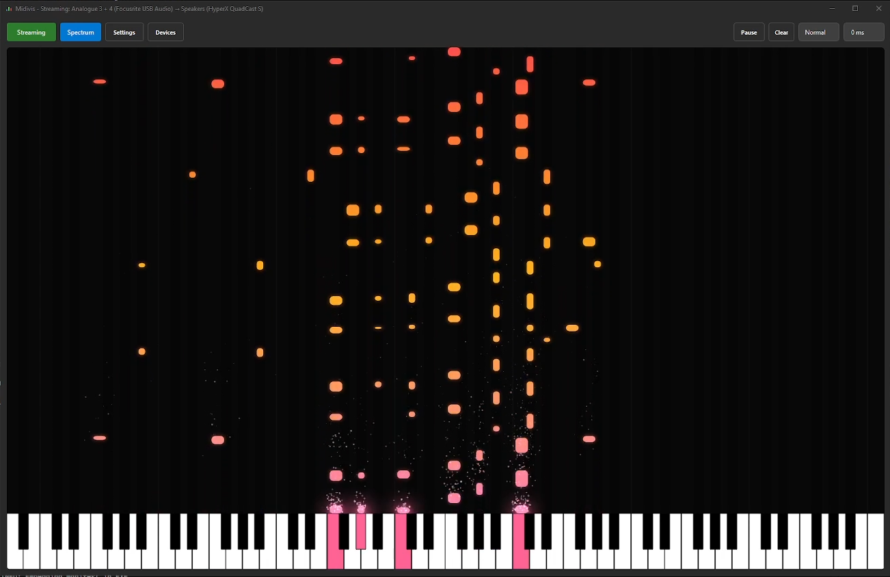

# Midivis

Midivis is a cross-platform desktop app to visualize MIDI Notes from Keyboards as well as stream audio. \
It allows you to easily screen-share performances to friends through apps like Discord.



## Features
- MIDI Visualization
  - Pause/Play/Clear
  - Compensate Delay
  - Change Speed
- Audio Streaming
  - Select Input/Output Devices
  - Mute Button
- Spectrum Visualizer
- Extensive Configuration
  - Note Gradient
  - Particle Effects

## Shortcuts
| Shortcut | Function |
|---|---|
| `F11` | Fullscreen Mode |
| `F9` | Toggle Toolbar |
| `F5` | Restart Audio Streaming |
| `F8` | Play some Demo Notes in the Piano Roll |


## Running Midivis
To quickly run Midivis, first clone the project:
```sh
git clone git@github.com:nlfmt/midivis
cd midivis
```

then run it:
```sh
pip install -r requirements.txt
python3 src/main.py
```

## Building Midivis
Building Midivis locally requires a python 3 installation.

### Windows
On Windows, you can just use the build script to build Midivis:
```pwsh
./build.bat
```
This will install all dependencies and build Midivis to `dist/Midivis.exe`.

### Linux
Not yet tested, but you should be able to build Midivis by running:
```sh
pip3 install -r requirements.txt
python3 -m Pyinstaller Midivis.spec
```

### Mac
Should be installable the same way as linux, but the application has not been tested on Mac systems as of now.

## License
This project is licensed under the MIT License